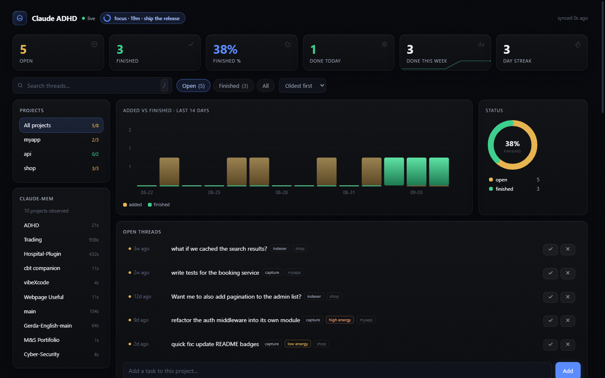

# Claude ADHD

> ⚠️ **This plugin is in test mode** — under active development and testing. Expect rough edges, and back up anything important before relying on it.

A Claude Code plugin for ADHD brains. It remembers the things you said but never finished — tasks, ideas, half-asked questions from past sessions — and brings them back gently.

## The capture question

Reminding is only as good as capture — if the forgotten work never landed anywhere, no reminder can find it. This plugin captures on two layers, so it catches things you never marked anywhere:

1. **Live capture** — while you work, Claude silently records tasks the moment you commit to them ("I'll deal with that after the release" counts, it doesn't have to sound like a todo) and marks them done when finished. Judgment happens in-context, not by keyword matching.
2. **Transcript backstop** — a local indexer scans your past session transcripts for the things people actually say: "I'll X later", "we should try", "what if we", "remind me to", TODO markers, unanswered questions, and sessions that died on a question you never answered. Even if the live layer misses something, the backstop picks it up from the record of the conversation.

The honest limits: a commitment you never expressed in any form can't be caught, and the live layer errs toward not recording (questions and brainstorming are deliberately excluded, so the index doesn't fill with noise).

Everything it captures can be surfaced:

- **Session digest** — when you start a session, it quietly surfaces the 1–3 most stale open threads, flags anything aging (2+ weeks), and notes what you finished since last visit.
- **Random nudges** — when your chat drifts into brainstorming or boredom, it occasionally drops a one-line "btw, you left this open" — never pushy, never more than twice per session.
- **`/remind-me`** — on demand: "what did I forget?" gets you a ranked list of open threads, and you can resume one, mark it done, or dismiss it forever.

Plus the tools around it:

- **Custom reminders** — tell Claude "remind me tomorrow at 3pm to check the deploy", "every session remind me to run tests first", or "occasionally remind me to stretch" — they surface naturally in the conversation when due. Also `/remind`.
- **Focus mode** — `/focus 25 [task]`: timed focus session. The plugin redirects you when the chat drifts, and wraps up with a summary when time's up.
- **Energy-aware** — tag tasks low/high energy. Say "I'm fried" and it only offers low-effort tasks.
- **Dashboard** — a local web page (auto-started on session start) with projects, stats, graphs, day streak, reminders, energy tags, and mark done/dismiss/resume buttons.

## Install

```bash
/plugin marketplace add shaheer-00/claude-adhd
/plugin install claude-adhd@claude-adhd
```

Requires Claude Code and Node.js. Nothing else — no dependencies, no API keys.

## How surfacing works

```
~/.claude/projects/**/*.jsonl   (your session transcripts, read-only)
        │
        ▼
  local indexer (pure Node, heuristics)
        │
        ▼
~/.claude/adhd/index.json       (open threads with cooldown state)
        │
        ▼
  hooks → context injection → Claude decides when/how to surface them
```

Cheap scripts for recall and anti-nag rules (3-day per-item cooldown, max 2 nudges per session); the model for judgment. Claude reads the live conversation and only speaks up when it actually fits.

## Reminders

Three kinds, created three ways:

| Kind | Example | When it appears |
|------|---------|-----------------|
| once | "remind me tomorrow 3pm to check the deploy" | at that time, once |
| recurring | "every session remind me to run tests first" / "daily, stand up" | each session / each day |
| random | "occasionally remind me to stretch" | surprise, max once a day |

Create them by just telling Claude ("remind me to X at Y"), with `/remind`, in the dashboard's Reminders panel, or via CLI:

```bash
node scripts/remind.mjs add "check the deploy" --at 2026-09-05T15:00   # once
node scripts/remind.mjs add "stretch" --in 2h                          # once, relative
node scripts/remind.mjs add "run tests first" --every session          # recurring
node scripts/remind.mjs add "drink water" --random                     # occasional
node scripts/remind.mjs list                                           # see what's set
```

Reminders live in `~/.claude/adhd/reminders.json`. Set `"reminders": false` in the config to turn injection off.

## Focus mode

```bash
/focus 25 ship the release      # in Claude Code (or just "focus on shipping for 25")
node scripts/focus.mjs start 25 "ship the release"
node scripts/focus.mjs status | stop
```

While active, the plugin's hook nudges the conversation back if it drifts, and announces a wrap-up when time's up. Config kill switch: `"focus": false`.

## Energy tags

Tag tasks when capturing (`--energy low|high`, or the dashboard's edit panel). Then:

- Tell Claude "I'm fried" / "no energy" — it only offers low-energy open tasks
- `node scripts/mark.mjs list --energy low`

## Dashboard

Start a session (or run `node scripts/server.mjs`) and open **http://127.0.0.1:37987**:



- projects list, current project, finished-vs-open stats, day streak, this-week summary
- 14-day completion/added graphs (inline SVG, no CDN)
- reminders panel: add/edit/handled/delete
- mark items done / dismissed / reopen, add new ones, tag energy

Bound to `127.0.0.1` only. No network exposure, no telemetry. If you use [claude-mem](https://github.com/thedotmack/claude-mem), its per-project open threads are merged into the dashboard automatically (read-only).

## Configuration

Optional `~/.claude/adhd/config.json`:

```json
{
  "reminderProbability": 0.1,
  "cooldownDays": 3,
  "maxNudgesPerSession": 2,
  "digestOnStart": true,
  "maxSessionsIndexed": 50,
  "maxItemAgeDays": 90,
  "dashboardPort": 37987,
  "randomReminderProbability": 0.15
}
```

Set `"dashboard": false` to never auto-start the server, `"capture": false` to disable live task capture, or `"reminders": false` to disable custom-reminder injection.

## Privacy

Everything stays on your machine. The scripts read your local Claude Code transcripts and write a local index. The dashboard binds to localhost only. Zero telemetry. claude-mem integration, if present, is read-only.

## Commands

- `/remind-me [topic]` — list forgotten open threads, optionally filtered by topic
- `/remind <message> [at <time> | every session|day | random]` — set a custom reminder
- `/focus [minutes] [task]` — start a timed focus session
- Or just say "remind me", "what did I forget?", "remind me to X at Y", "focus on X", "I'm fried" — the skill triggers on those too.

## Tips

- "mark 2 done", "dismiss the auth one" — manage items in plain language.
- If nudges feel too chatty, lower `reminderProbability`; if the digest is noise, set `digestOnStart: false` and rely on `/remind-me`.
- Auto done-detection is heuristic (it looks for completion phrasing in later sessions). `/remind-me` lets you correct it — if something shows up that's actually finished, say "mark it done".

## Development

```bash
node fixtures/run-tests.mjs            # full test suite (fixture transcripts, throwaway dirs)
node scripts/indexer.mjs               # scan transcripts → index
node scripts/mark.mjs list             # see what's open
node scripts/remind.mjs list           # see active reminders
node scripts/server.mjs                # dashboard (http://127.0.0.1:37987)
```

## Feedback

This plugin is in test mode — feedback shapes what gets built next. Leave your thoughts (what helps, what's annoying, what's missing) on the [Reddit discussion](https://www.reddit.com/r/ClaudeAI/comments/1w7tb2v/i_built_a_claude_code_plugin_for_my_adhd_brain_it/) or open an issue.

## Support

If this plugin helps you focus, you can [buy me a coffee](https://buymeacoffee.com/shaheer0.0) ☕
